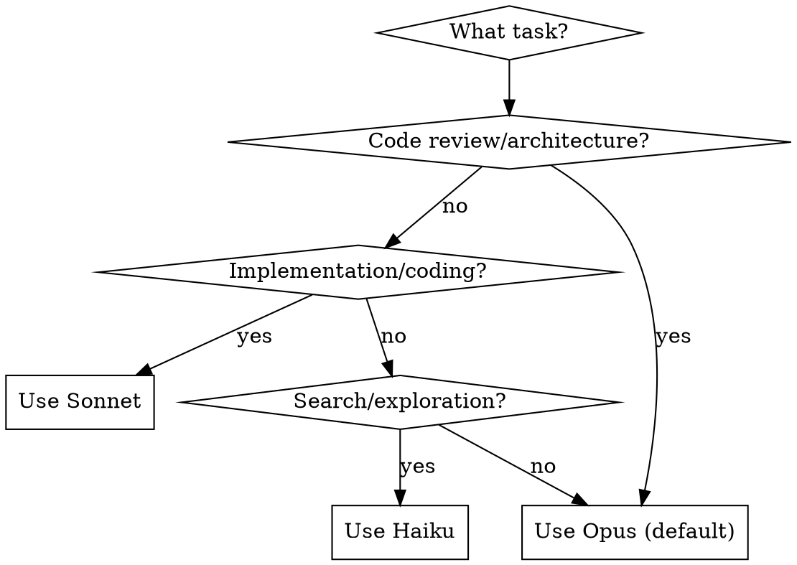

# Multi-Model Subagent Strategy Implementation Plan

> **For Claude:** REQUIRED SUB-SKILL: Use superpowers:executing-plans to implement this plan task-by-task.

**Goal:** 在所有 superpowers skills 中实现基于模型专长的智能调度策略，使 Opus 负责思考与调度，Sonnet 负责代码执行，Haiku 负责快速搜索。

**Architecture:** 通过在 Task 工具调用中添加 `model` 参数来指定 subagent 使用的模型。默认不指定则使用 Opus，需要代码实现时指定 Sonnet，需要搜索探索时指定 Haiku。

**Tech Stack:** Claude Code Task tool, SKILL.md markdown 文件

---

## 模型分工策略

| 模型 | 专长 | 使用场景 |
|------|------|----------|
| **Opus** (默认) | 高智商思考与调度 | 规格审查、代码质量审查、架构决策、复杂推理 |
| **Sonnet** | 代码和文档写入执行 | 实现代码、写测试、执行修复、文档编写 |
| **Haiku** | 快速搜索和探索 | 代码库探索、文件搜索、快速信息检索 |

---

## Task 1: 更新 subagent-driven-development/implementer-prompt.md

**Files:**
- Modify: `/Users/bryanhu/.claude/plugins/cache/claude-plugins-official/superpowers/4.0.3/skills/subagent-driven-development/implementer-prompt.md`

**Step 1: 阅读当前文件内容**

确认当前 Task 工具调用格式。

**Step 2: 添加 model: sonnet 参数**

将模板中的 Task 工具调用更新为：

```markdown
Task tool (general-purpose):
  model: sonnet
  description: "Implement Task N: [task name]"
  prompt: |
    ...
```

**Step 3: 验证格式正确**

确保 YAML 格式正确，model 参数位置合理。

**Step 4: Commit**

```bash
git add skills/subagent-driven-development/implementer-prompt.md
git commit -m "feat: specify sonnet model for implementer subagent

Implementer agents handle code writing and execution, which is
Sonnet's specialty.

Co-Authored-By: Claude <noreply@anthropic.com>"
```

---

## Task 2: 更新 subagent-driven-development/SKILL.md 添加模型说明

**Files:**
- Modify: `/Users/bryanhu/.claude/plugins/cache/claude-plugins-official/superpowers/4.0.3/skills/subagent-driven-development/SKILL.md`

**Step 1: 阅读当前文件**

确认当前内容和结构。

**Step 2: 在 "## Prompt Templates" 部分后添加模型策略说明**

```markdown
## Model Strategy

| Subagent | Model | Rationale |
|----------|-------|-----------|
| Implementer | Sonnet | Code writing and execution |
| Spec Reviewer | Opus (default) | Requires deep reasoning for spec compliance |
| Code Quality Reviewer | Opus (default) | Requires architectural understanding |

**Note:** When dispatching subagents, specify `model: sonnet` for implementer tasks.
Reviewer subagents should use the default Opus for critical thinking.
```

**Step 3: 更新流程图注释（可选）**

在流程图节点描述中添加模型提示。

**Step 4: Commit**

```bash
git add skills/subagent-driven-development/SKILL.md
git commit -m "docs: add model strategy section to subagent-driven-development

Clarifies which model to use for each subagent type:
- Sonnet for implementation
- Opus for reviews

Co-Authored-By: Claude <noreply@anthropic.com>"
```

---

## Task 3: 更新 dispatching-parallel-agents/SKILL.md 添加模型选择指南

**Files:**
- Modify: `/Users/bryanhu/.claude/plugins/cache/claude-plugins-official/superpowers/4.0.3/skills/dispatching-parallel-agents/SKILL.md`

**Step 1: 阅读当前文件**

确认当前内容。

**Step 2: 在 "## Agent Prompt Structure" 后添加模型选择部分**

```markdown
## Model Selection for Parallel Agents

Choose model based on task type:

| Task Type | Model | Example |
|-----------|-------|---------|
| Code fixes, implementations | Sonnet | "Fix test failures", "Implement feature" |
| Architecture review | Opus | "Review design decisions" |
| Codebase exploration | Haiku | "Find all usages of X" |

**Example with model specification:**

```typescript
// Code implementation tasks → Sonnet
Task("Fix agent-tool-abort.test.ts failures", model: "sonnet")
Task("Fix batch-completion-behavior.test.ts failures", model: "sonnet")

// Exploration tasks → Haiku
Task("Find all files using deprecated API", model: "haiku")
```
```

**Step 3: Commit**

```bash
git add skills/dispatching-parallel-agents/SKILL.md
git commit -m "feat: add model selection guide for parallel agents

Adds guidance on choosing the right model:
- Sonnet for code fixes and implementations
- Opus for reviews
- Haiku for exploration

Co-Authored-By: Claude <noreply@anthropic.com>"
```

---

## Task 4: 更新 brainstorming/SKILL.md 使用 Haiku 进行探索

**Files:**
- Modify: `/Users/bryanhu/.claude/plugins/cache/claude-plugins-official/superpowers/4.0.3/skills/brainstorming/SKILL.md`

**Step 1: 阅读当前文件**

确认当前内容。

**Step 2: 在 "## The Process" 的 "Understanding the idea" 部分添加模型提示**

在 "Check out the current project state first (files, docs, recent commits)" 后添加：

```markdown
**Exploration tip:** When dispatching subagents for codebase exploration, use `model: haiku` for fast, cost-effective searches.
```

**Step 3: Commit**

```bash
git add skills/brainstorming/SKILL.md
git commit -m "docs: recommend haiku for exploration in brainstorming

Haiku is ideal for fast codebase exploration during brainstorming phase.

Co-Authored-By: Claude <noreply@anthropic.com>"
```

---

## Task 5: 更新 executing-plans/SKILL.md 指定 Sonnet 用于执行

**Files:**
- Modify: `/Users/bryanhu/.claude/plugins/cache/claude-plugins-official/superpowers/4.0.3/skills/executing-plans/SKILL.md`

**Step 1: 阅读当前文件**

确认当前内容。

**Step 2: 在 "## The Process" 的 "Step 2: Execute Batch" 部分添加模型说明**

```markdown
### Step 2: Execute Batch
**Default: First 3 tasks**

**Model tip:** When executing implementation tasks, consider using `model: sonnet` for code-heavy work.

For each task:
1. Mark as in_progress
...
```

**Step 3: Commit**

```bash
git add skills/executing-plans/SKILL.md
git commit -m "docs: recommend sonnet for execution in executing-plans

Sonnet excels at code implementation tasks.

Co-Authored-By: Claude <noreply@anthropic.com>"
```

---

## Task 6: 更新 systematic-debugging/SKILL.md 使用 Haiku 进行搜索

**Files:**
- Modify: `/Users/bryanhu/.claude/plugins/cache/claude-plugins-official/superpowers/4.0.3/skills/systematic-debugging/SKILL.md`

**Step 1: 阅读当前文件**

确认当前内容。

**Step 2: 在 "Phase 1: Root Cause Investigation" 的搜索相关步骤添加提示**

在 "3. Check Recent Changes" 或数据流追踪部分添加：

```markdown
**Search tip:** When dispatching subagents to search for code patterns or trace data flow, use `model: haiku` for fast exploration.
```

**Step 3: Commit**

```bash
git add skills/systematic-debugging/SKILL.md
git commit -m "docs: recommend haiku for search in debugging

Haiku provides fast, cost-effective code exploration during debugging.

Co-Authored-By: Claude <noreply@anthropic.com>"
```

---

## Task 7: 更新 requesting-code-review/SKILL.md 保持 Opus 用于审查

**Files:**
- Modify: `/Users/bryanhu/.claude/plugins/cache/claude-plugins-official/superpowers/4.0.3/skills/requesting-code-review/SKILL.md`

**Step 1: 阅读当前文件**

确认当前内容。

**Step 2: 在 "## How to Request" 部分添加模型说明**

```markdown
**2. Dispatch code-reviewer subagent:**

Use Task tool with superpowers:code-reviewer type, fill template at `code-reviewer.md`

**Note:** Code review requires deep reasoning. Use default Opus model (do not specify `model` parameter).
```

**Step 3: Commit**

```bash
git add skills/requesting-code-review/SKILL.md
git commit -m "docs: clarify opus for code review

Code review requires deep reasoning, Opus is the right choice.

Co-Authored-By: Claude <noreply@anthropic.com>"
```

---

## Task 8: 更新 writing-skills/SKILL.md 使用 Sonnet 进行测试

**Files:**
- Modify: `/Users/bryanhu/.claude/plugins/cache/claude-plugins-official/superpowers/4.0.3/skills/writing-skills/SKILL.md`

**Step 1: 阅读当前文件**

确认当前内容。

**Step 2: 在 "## RED-GREEN-REFACTOR for Skills" 部分添加模型说明**

在 "### RED: Write Failing Test (Baseline)" 部分添加：

```markdown
### RED: Write Failing Test (Baseline)

Run pressure scenario with subagent WITHOUT the skill. Document exact behavior:
...

**Model tip:** Use `model: sonnet` for test execution subagents. Sonnet follows instructions well and is cost-effective for repeated testing iterations.
```

**Step 3: Commit**

```bash
git add skills/writing-skills/SKILL.md
git commit -m "docs: recommend sonnet for skill testing

Sonnet is ideal for repeated test iterations when writing skills.

Co-Authored-By: Claude <noreply@anthropic.com>"
```

---

## Task 9: 创建 multi-model-strategy.md 参考文档

**Files:**
- Create: `/Users/bryanhu/.claude/plugins/cache/claude-plugins-official/superpowers/4.0.3/skills/multi-model-strategy.md`

**Step 1: 创建新的参考文档**

```markdown
# Multi-Model Subagent Strategy

## Overview

When dispatching subagents via the Task tool, choose the right model based on task type:

| Model | Parameter | Specialty | Use For |
|-------|-----------|-----------|---------|
| **Opus** | (default) | Deep reasoning, planning | Code review, spec compliance, architecture decisions |
| **Sonnet** | `model: sonnet` | Code execution, implementation | Writing code, fixing bugs, implementing features |
| **Haiku** | `model: haiku` | Fast search, exploration | Codebase exploration, file search, quick lookups |

## Quick Reference

```typescript
// Opus (default) - complex reasoning
Task("Review architecture", subagent_type: "general-purpose")

// Sonnet - implementation
Task("Implement feature X", subagent_type: "general-purpose", model: "sonnet")

// Haiku - exploration
Task("Find all usages of deprecated API", subagent_type: "Explore", model: "haiku")
```

## Decision Flow



## Cost-Benefit Analysis

| Scenario | Model | Rationale |
|----------|-------|-----------|
| Implement 5 tasks | Sonnet | 5x implementation, cost-effective |
| Review 5 implementations | Opus | Quality matters more than cost |
| Search for patterns | Haiku | Fast, cheap, good enough |
| Complex debugging | Opus | Deep reasoning required |
| Simple test fixes | Sonnet | Straightforward code changes |
```

**Step 2: Commit**

```bash
git add skills/multi-model-strategy.md
git commit -m "docs: add multi-model strategy reference

Central reference for model selection when dispatching subagents:
- Opus for reasoning
- Sonnet for implementation
- Haiku for exploration

Co-Authored-By: Claude <noreply@anthropic.com>"
```

---

## Task 10: 更新 using-superpowers/SKILL.md 添加模型策略参考

**Files:**
- Modify: `/Users/bryanhu/.claude/plugins/cache/claude-plugins-official/superpowers/4.0.3/skills/using-superpowers/SKILL.md`

**Step 1: 阅读当前文件**

确认当前内容。

**Step 2: 在文件末尾添加模型策略参考**

```markdown
## Model Strategy for Subagents

When dispatching subagents, choose the right model:
- **Opus (default):** Code review, architecture, complex reasoning
- **Sonnet:** Implementation, coding, test writing
- **Haiku:** Exploration, search, quick lookups

See multi-model-strategy.md for detailed guidance.
```

**Step 3: Commit**

```bash
git add skills/using-superpowers/SKILL.md
git commit -m "docs: add model strategy reference to using-superpowers

Provides quick guidance on model selection for subagents.

Co-Authored-By: Claude <noreply@anthropic.com>"
```

---

## Verification Checklist

After all tasks complete:

- [ ] All modified files have correct markdown syntax
- [ ] Model parameter examples use correct format (`model: sonnet` or `model: haiku`)
- [ ] Each skill has appropriate model guidance
- [ ] Central reference document (multi-model-strategy.md) is comprehensive
- [ ] All commits follow project commit message style
